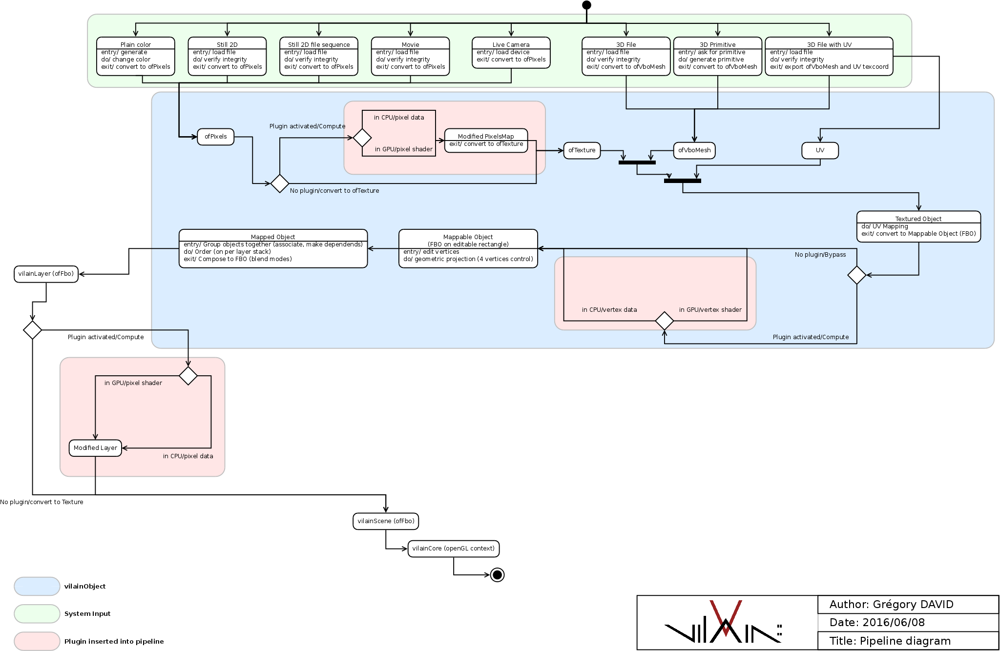

# vilain::
[](https://travis-ci.org/groolot/vilain)

# Install
1. clone the repository ```git clone https://git.framasoft.org/groolot/vilain.git```
2. ```cd vilain```
3. lauch install script: ```./install_prerequisites```
4. if errors reported, feel free to write an issue

# Credits 
## Lead developer
- Gregory David

## Modeling
- Gregory David
- Jean-Emmanuel Doucet

## Design
- François-Xavier Lebret

## Previous contributions
- Ronan Legardinier (research and GUI)
- Aurelien Roux (Raspberry Pi)
- Florian Thierry (Debian GNU/Linux)

# UML
## Pipeline

## Use case
